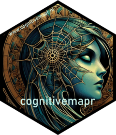

<!-- README.md is generated from README.Rmd. Please edit that file -->

```{r, include = FALSE}
knitr::opts_chunk$set(
  collapse = TRUE,
  comment = "#>",
  fig.path = "man/figures/README-",
  out.width = "100%"
)
```

# cognitivemapr

<!-- badges: start -->


<!-- badges: end -->

# cognitivemapr 

Cognitive Mapping is a method specifically designed to study belief systems as espoused by individuals or organisations and has several advantages over other methods. The goal of `cognitivemapr` is to reduce the initial investment currently needed to start using the method.

## Installation

You can install the development version of cognitivemapr from [GitHub](https://github.com/) with:

``` r
# install.packages("devtools")
devtools::install_github("Fesch-star/cognitivemapr")
```

## Dependencies

To run the code you need to install the following packages:

- tidyverse - built under R version 4.0.5
	v ggplot2 3.3.3     v purrr   0.3.4
	v tibble  3.1.1     v dplyr   1.0.5
	v tidyr   1.1.3     v stringr 1.4.0
	v readr   1.4.0     v forcats 0.5.1
	
- igraph - built under R version 4.0.5
- tidygraph
- ggraph

## Example

This is a basic example which shows you how to solve a common problem:

```{r example, eval=FALSE}
library(cognitivemapr)
## basic example code
```

What is special about using `README.Rmd` instead of just `README.md`? You can include R chunks like so:

```{r cars, eval=FALSE}
summary(cars)
```

You'll still need to render `README.Rmd` regularly, to keep `README.md` up-to-date. `devtools::build_readme()` is handy for this. You could also use GitHub Actions to re-render `README.Rmd` every time you push. An example workflow can be found here: <https://github.com/r-lib/actions/tree/v1/examples>.

You can also embed plots, for example:

```{r pressure, echo = FALSE}
plot(pressure)
```

In that case, don't forget to commit and push the resulting figure files, so they display on GitHub and CRAN.

## Contributing

## Authors & Acknowledgements

## License

This project is licensed under the terms of the [GPL-3.0 License](/LICENSE.md)

## Citation

Please cite this project as follows:
Van Esch, Femke A.W.J., Snellens, Jeroen F.A. (forthcoming). 'How to ‘measure’ Ideas. Introducing the method of cognitive mapping to the domain of ideational policy studies'. Journal of European Public Policy.

## Contact

Femke van Esch: F.a.w.j.vanEsch@uu.nl
