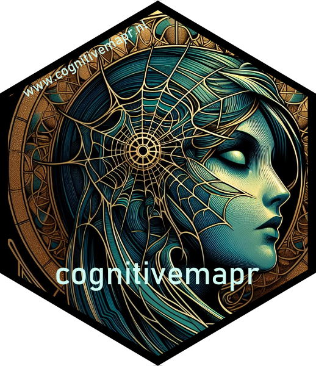

<!-- README.md is generated from README.Rmd. Please edit that file -->

# cognitivemapr

<!-- badges: start -->


[](https://www.gnu.org/licenses/gpl-3.0)
[](https://doi.org/10.5281/zenodo.11068150)

<!-- badges: end -->



Cognitive Mapping (CM) is a method specifically designed to study belief
systems as espoused by individuals or organisations and has several
advantages over other methods. The goal of `cognitivemapr` is to reduce
the initial investment currently needed to start using the method. The
functions in the package allow you to conduct a CM analysis similar to
that conducted in the following publication: Van Esch, Femke A.W.J.,
Snellens, Jeroen F.A. (2024). ‘How to ’measure’ Ideas. Introducing the
method of cognitive mapping to the domain of ideational policy studies’.
*Journal of European Public Policy*, 31(2), 428-451.
<https://doi.org/10.1080/13501763.2022.2155215>

## Installation

You can install the development version of cognitivemapr from
[GitHub](https://github.com/) with:

``` r
# install.packages("devtools")
devtools::install_github("Fesch-star/cognitivemapr")
```

## Dependencies

Installing the package (above) will install the package dependencies:

-   `knitr`
-   `readr`
-   `rmarkdown`
-   `testthat`
-   `dplyr`
-   `igraph`
-   `tibble`

## Tutorials

Running the functions in the cognitivemapr package requires your data to
be compiled into an edge and nodelists.

-   For an instruction on the formatting requirements, see the
    [Preprocessing edge and nodelist tutorial](https://fesch-star.github.io/cognitivemapr/articles/Tutorial_create_edge_nodelists.html). This tutorial also provides an
    explanation on how to use the three functions in the package that
    may help you reformat your data.

-   For more information regarding the analytical functions in the
    package, please refer to the
    [Tutorial on cognitivemapr analysis functions](https://fesch-star.github.io/cognitivemapr/articles/Tutorial_cognitivemapr_analysis_functions.html)

## Contributing

We are very happy with any suggestions or contributions to improve the
package. Read the [contributing guidelines](/CONTRIBUTING.md) for
instructions.

## Authors & Acknowledgements

The `cognitivemapr` package was created by Femke van Esch and Jelle
Treep with contributions of Neha Moopen and Jeroen Snellens.

## License

This project is licensed under the terms of the [GPL-3.0
License](/LICENSE.md)

## Citation

Please cite this project as follows:

    @software{van_Esch_cognitivemapr_Functions_for,
    author = {van Esch, Femke and Treep, Jelle and Moopen, Neha and Snellens, Jeroen},
    license = {GPL-3.0},
    title = {{cognitivemapr: Functions for Cognitive Mapping Analysis}},
    url = {https://github.com/Fesch-star/cognitivemapr}
    }
