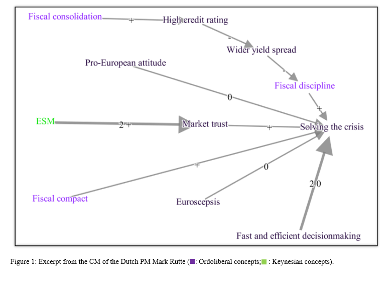

```{r, include = FALSE}
knitr::opts_chunk$set(
  collapse = TRUE,
  comment = "#>"
)
```

# Introduction

<Add a short introduction here>

# Getting started

## Step 1: Install `cognitivemapr`

```{r eval=FALSE}
install.packages("devtools", repos = "https://cloud.r-project.org/")
library(devtools)

devtools::install_github("https://github.com/Fesch-star/cognitivemapr")
```

```{r setup}
library(cognitivemapr)
```

## Step 2: Read example data

```{r, results='hide', warning=FALSE, message=FALSE}
library(readr)

load("../data/rutte_p2_edgelist.rda")
load("../data/rutte_p2_nodelist.rda")


```

### Step 2.1: Display first rows

```{r}
head(rutte_p2_edgelist)
head(rutte_p2_nodelist)
```

## Step 3: Calculating basic CM measures

Running the `calc_degrees_goW` function using the data of Rutte shows
that the function returns a dataframe in which all the original data on
the nodes in the CM is combined with the basic measures. Running the
summary shows some basic characterising and statistical information
regarding the variables in the dataframe. This provides some first
indication regarding the number of concepts in the CM, the difference in
strenght of the concepts in the map (minimum, maximum, mean w_degree) as
well as the overall complexity of the map (mean degree) that may help
compare the CM to others.

```{r}
#running the function with the data of Mark Rutte, and storing it as a df
rutte_p2_node_measures <- cognitivemapr::calculate_degrees(rutte_p2_edgelist, rutte_p2_nodelist)

#provide summary statistics for all measures
summary(rutte_p2_node_measures)
```

### Step 3.1: Sum of saliency

In addition, the sum of saliency divided by two tells us of how many
relations the CM consists, which is the most commonly used measure of
the relative size of a CM in comparison to others.

```{r}
sum(rutte_p2_node_measures$w_degree)/2
```

### Step 3.2: Top 10 concepts

At the concept level, the output of the calc_degrees_goW function also
provides us with the first feel of the content of the CM. The table
below, for instance shows the top 10 concepts in terms of saliency and
economic paradigm (ordoliberal or keynesian) for the map of Rutte. The
table provides a first indication that the Dutch prime minister was
highly concerned about the Eurozone crisis, and was discussing several
institutional and predominantly ordoliberal measures to tackle the
crisis, while also debating the value of being pragmatic.

```{r}
# order the dataframe by saliency
rutte_p2_node_measures <- rutte_p2_node_measures[order(rutte_p2_node_measures$w_degree, decreasing = TRUE),]
rutte_p2_node_measures[1:10,c("id", "node_name", "w_degree", "paradigms")]

```

## Step 4: Calculating the evaluation of concepts

By analysing the relationships between the concepts in a path, scholars
can establish if, and how concepts are perceived within the context of
the CM: positively, negatively or ambiguously (Hart 1977). For instance,
assuming that 'solving the crisis' is considered a positive goal, we can
derive from **figure 1** that 'fiscal discipline' is valued positively
as it contributes positively to 'solving the crisis', whereas 'wider
yield spreads' is negatively evaluated as it contributes negatively to
'fiscal discipline. The relation between 'pro-European attitude' and the
positive goal solving the crisis is seen as non-existent (represented by
a 0 sign for the relation. As this concept does not have any other
outgoing paths, 'pro_European attitude' is evaluated as ambiguous within
the context of this map.

## change the figure to one showing the true evaluations & rewrite the text



Running the function 'evaluation_step' establishes the evaluation of the
concepts in the map by analysing their outgoing relations in this
fashion, taking into account the sign and weight of the relation as well
as the value of the concepts these outgoing relations feed into. To run
this function the nodelist that was returned from the function
calculate_degrees needs to be used (in the full CM for Rutte the concepts in figure 1 have more relations than displayed in the figure and thus their
evaluation as show in the next step may be different).

```{r}

test_edge1 <- cognitivemapr::evaluation_step(rutte_p2_edgelist, rutte_p2_node_measures)[[1]]
test_node1 <- cognitivemapr::evaluation_step(rutte_p2_edgelist, rutte_p2_node_measures)[[2]]

# find out the rownumber for the data on node with node_name "High credit rating' 
rownr <- which(grepl("High credit rating", rutte_p2_node_measures$node_name))

# show concept and evaluation

test_node1[c(rownr), c("id", "node_name","val_run1")] 

```

However, by running this function once, the analysis does not take into
account that the evaluation of the concepts may change as a result of
this calculation. Running the evaluation_step function on the concepts
in figure 1, once would result in a negative evaluation for the concept
'high credit rating' for at the start of the analysis, the concept
'wider yield spread' was still assumed to be positive. However, by evaluating its outgoing relations to it's immediate neighbouring concepts, has changed the evaluation of the concept 'wider yield spread' to ambiguous (0). This would in turrn change the evaluation of the concept 'high credit rating' to ambiguous. Running the
evaluate_step function again on the output of the first run, shows that indeed 'high credit rating' now has a value of 0.

```{r}
test_edge2 <- cognitivemapr::evaluation_step(test_edge1, test_node1)[[1]]
test_node2 <- cognitivemapr::evaluation_step(test_edge1, test_node1)[[2]]

# find out the rownumber for the data on node with node_name "High credit rating' 
rownr <- which(grepl("High credit rating", rutte_p2_node_measures$node_name))

# show concept and evaluation

test_node2[c(rownr), c("id", "node_name","val_run1")] 

# delete the test data, so not to crowd the environment
rm(test_edge1,test_edge2, test_node1, test_node2, rownr)
```

### Step 4.1: Set maximum number of iterations

This means that to arrive at the accurate evaluation of the concepts in the
map, we need to run the evaluation_step function multiple times. We
want to be sure that we have reiterated across all concepts in all paths
in the CM, which means that at maximum we need to iterate through the function the same number of times as the number of steps of the longest path in the CM (this presumes the CM is not cyclical, if a CM is cyclical the evaluate_concepts function
randomly stops the cycle at this point, fixing the evaluation of the concepts to the result of the last iteration. We will work on a more elegant solution in the next version of the Package). The set_iterations calculates this number of iterations. Running this function for the example data for Rutte shows that the number of iterations for this map should be 5.

```{r}
cognitivemapr::set_iterations(rutte_p2_edgelist, rutte_p2_nodelist)

```

### Step 4.2: Calculating the evaluation of concepts holistically

The set_iterations function is incorporated in the 'evaluate_concepts' function, which runs the evaluation_step function the appropriate number of times while adjusting and
storing the changing evaluation values of the concepts. The function takes an edgelist and the node_measures list that was returned from the calculate_degrees function above.

```{r}
result_list <- cognitivemapr::evaluate_concepts(rutte_p2_edgelist, rutte_p2_node_measures)

```

[improve the functions along the lines of what Thomas did for the software: 1) make it stop when a balance is reached 2) for cyclical graphs, let the researcher chose what values to take for the unstable concepts]

If we print the top of the node_measures list resulting from the final iteration, 
it shows how conducting a CM analysis in this fashion reveals both the nature, strength and complexity of Rutte's ideas as well as whether they are valued positively or negatively.

```{r}
head(result_list[[5]][[2]])
```
## Step 5: Simple graphical visualisation

However in order to reap the full benefits of CM analysis and grasp the relations between Rutte's ideas as well as reveal the argumentation and narrative underlying his belief system, the CM is best analysed visually in its graphical form. The draw_cm function creates a first simple visual graph of the CM on the basis of the edge and nodelist. In step 7 of this tutorial a function is introduced that produces a more encompassing visualisation with several interactive features is introduced.

```{r}
#run the function
simple_cm_rutte_p2 <- cognitivemapr::draw_cm(rutte_p2_edgelist, rutte_p2_nodelist)

```


## Step 6: Categorical analysis: Paradigms and policy instruments

The potential of the CM analysis may be expanded even further by making use of the theoretical notion that there are different types of ideas. Two types of ideas often used in the literature are paradigms and instrumental ideas. Paradigms are often seen as 'ideas on steriods'(ref Hall), they encompass xx. Traditionally, rivalling paradigms are also perceived as incommensurable. 
The example data for this package is derived from a speech concerning the Eurozone crisis. In this domain, scholars have identified two competing paradigms that underly the policy debate: (neo)Keynesianism and Ordoliberalism (Dullien and Guérot
2012; Hall 2014). To capture the paradigmatic orthodoxy of Rutte's belief system, all concepts in his CM were classified as either Keynesian, Ordoliberal or neutral. Applying the 'paradigm_support' function calculates the support by calculating the relative weighted degree (or saliency in CM terms) of all the Ordoliberal and Keynesian concepts in the map. Reflecting the idea that competing paradigms are incommensurable, when an Ordoliberal concept is evaluated negatively, its saliency (weighted degree) score is added to the support for the Keynesian paradigm and vice versa. Ambiguously evaluated concepts are omitted from the analysis. 

### Step 6.1: Paradigm Support

In order to run the paradigm_support function, first the calculate_degrees function as well as the evaluate_concepts functions need to be ran first. As such, we will use the nodelist that resulted from the last iteration of the evaluate_concepts function as the input for the paradigm support function. In addition we need to derive the names of the paradigms present in the data. 

```{r}
# store the result of the last iteration of evaluate_concepts as the new 'node_measures' df

rutte_p2_node_measures <- result_list[[5]][[2]]

# Derive all paradigm names from this dataframe, and store them in a list

paradigms <- unique(rutte_p2_node_measures$paradigms)
paradigms <- stats::na.omit (paradigms) # omitting the NULL category
paradigm_a <- paradigms[1]
paradigm_b <- paradigms[2]

```

Then run the paradigm_support function with these parameters, and store this in the node_measures dataframe

```{r}
# run the paradigm support function on this analysed data

rutte_p2_node_measures <- cognitivemapr::paradigm_support(rutte_p2_node_measures, paradigm_a, paradigm_b)

```

When summing up all the scores in the columns of both paradigms (displayed as a percentage of the total saliency of the CM), it is clear that this CM of Rutte signals a strong support for the Ordoliberal paradigm and limited support for the Keynesian paradigm.

```{r}
# calculate the total saliency (weighted degree) of the CM
w_degree <- sum(rutte_p2_node_measures$w_degree)

# make an empty df with names of instruments as ?

par_support<- vector(mode="numeric")

# calculate the support for each instrument
for (paradigm in paradigms) {
  score <- sum(rutte_p2_node_measures[paradigm]/w_degree)
  par_support <- append(par_support, score)
}

# show the results in a dataframe
data.frame(paradigms, par_support)

#delete temporary values
rm(paradigm, score)

```

### Step 6.2: Instrument Support

In a similar way, but without the added complexity of  the idea of incommensurability in the analysis, the instrument_support function calculates the support for different types of policy instruments embedded in the CM. In order to use this function, the concepts in the CM need to be categorised as belonging to a certain type of policy instrument. In de example data for this package seven policy instruments are distinguished: Stronger EU fiscal regulation, structural reforms, monetary measures by the ECB, economic stimulation, fiscal support, financial market measures and EMU reforms (Van Esch & snellens 2024). In this case, the calculation simply lists whether the concepts belonging to the different categories are evaluated positively or negatively taking the saliency (weighted degree) of the concept into account and stores the values in the node_measures dataframe.
To execute the function, we first need to derive all instrument-names included in the data and store it in a vector.

```{r}
# Derive all instrument names from the dataframe, and store them in a list

instruments <- unique(rutte_p2_node_measures$instruments)
instruments <- stats::na.omit (instruments) # omitting the NULL category

```


```{r}
rutte_p2_node_measures <- cognitivemapr::instrument_support(rutte_p2_node_measures, instruments)

```

When summing up all the scores in the columns of all the instruments (as a percentage of the total saliency of the CM), it shows that Rutte
favours implementing structural reforms and stronger fiscal regulation
over making institutional reforms to EMU, fiscal support and economic
stimulation. The policy instruments financial market measures and ECB
measures that were originally included in the empirical research are absent from Rutte's CM altogether. An analysis along these lines would allow us to compare the extent the instrumental ideas of Rutte influenced the Dutch management of
the Eurozone crisis.

```{r}
# make an empty vector to store the data in
instr_support<- vector(mode="numeric")

# calculate the support for each instrument
for (instrument in instruments) {
  score <- sum(rutte_p2_node_measures[instrument]/w_degree)
  instr_support <- append(instr_support, score)
}

# show the results in a dataframe
data.frame(instruments, instr_support)

#remove temporary values
rm(instrument, score)

```

In essence, the instrument_support function conducts a rather straightforward categorical analysis. So while for the example data categorising the concepts in the CM in terms of type of policy instrument may be relevant, scholars can use this function to conduct categorical analyses using any other type of categorisation relevant to their research. In contrast to the paradigm_support function also the number of categories is flexible. 

## Step 7:: Interactive visualisation of the CM

As argued above, to conduct a narrative analysis of the CM, the most convenient way is to make a visual representation of the CM. Using the visNetworks package, it is possible to draw more sophisticated CMs that include information about the paradigms and instruments and that are more easy to read. In addition, with this package a CM can be made interactive, allowing the user to move the concepts, zoom in and out. In addition, it creates containers for the different instrument types so the instrument-concepts can be shown both individually, or collapsed into their category. In order to use such features, the edgelist and node_measures lists must be reformatted to work with the VisNetworks package. The prep_cm_visualisation function will conduct this reformatting.

```{r}
# run the prep_cm_visualisation function
interact_cm_lists <- cognitivemapr::prep_cm_visualisation(rutte_p2_edgelist,rutte_p2_node_measures)

# extract and store the new edge and node_measures list
rutte_p2_edgelist <- interact_cm_lists[[1]]
rutte_p2_node_measures <- interact_cm_lists[[2]]

```

Subsequently, the interactive_visual_cm function will produce  the interactive CM for the researcher to analyse. In order for the r

```{r}
# create the interactive cm
interactive_cm_rutte_p2 <- cognitivemapr::interactive_visual_cm(rutte_p2_edgelist, rutte_p2_node_measures)

# if a group consists of one value, the clustering only shows the node not the group

```


## Step 8: Causal Power [to be added in the next version]

Finally, taking full advantage of its graphical nature, CM can be used to establish the causal strength of the policy instruments identified in a map. For this we combine the narrative analysis with the quantitative measures. We start by assuming that the higher the weight of the link between cause and effect, the stronger actors believe in its causal effect. In addition, we assume that the larger the distance between the cause and the effect (the more logical steps it takes to explain the relationship between instrument and goal), the weaker the presumed causal power of the instrument (cf. Septer, Dijkstra, and Stokman 2012; Shapiro and Bonham 1973). On the basis of this, we propose that the causal power (CP) of an instrument on a particular goal may be established as follows (Septer, Dijkstra, and Stokman 2012: First, for each subsequent concept in the antecedent path, its autonomous power (AP) may be determined following the
calculation:

AP = Ev*W*(0.9(D-1)); Whereby: Ev = Evaluation of the cause concept (-1,
0, +1) W = Weight of the relation D = Distance/steps to the effect
concept

To calculate the total causal power of a policy instrument, the
AP-scores of all concepts in the path are multiplied:

CP = AP1 \* AP2 \* ... APi

In figure 1, the causal power of the concept 'ESM' (D=2) runs via (W=2,
EV=+1) the concept 'market trust' (D=1), which in turn positively feeds
into (W=1, EV=+1) 'solving the crisis'. The causal power of ESM is thus
calculated as follows:

CP=(+1*2*(0.9 (2-1)) \* (+1*1*(0.9 (1-1)) = 1.8

Scholars have used similar analyses to derive policy preferences in the
domain of environmental and foreign policy decisions to identify
conditions under which ideas affect policies and even to run simulations
of policy making processes (Bonham, Shapiro, and Trumble 1979; Hart
1976).
